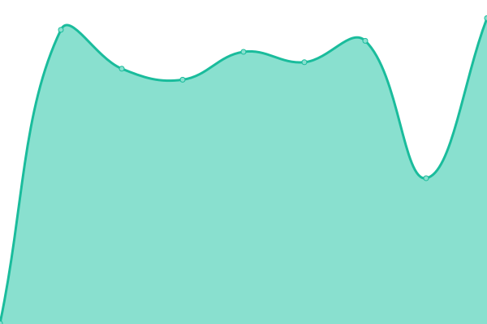

# [📈 Live Status](https://PascaleBeier.github.io/buycheapsolar-uptime): <!--live status--> **🟩 All systems operational**

This repository contains the open-source uptime monitor and status page for [Pascale Beier](https://devsfordevs.shop), powered by [Upptime](https://github.com/upptime/upptime).

With [Upptime](https://upptime.js.org), you can get your own unlimited and free uptime monitor and status page, powered entirely by a GitHub repository. We use [Issues](https://github.com/PascaleBeier/buycheapsolar-uptime/issues) as incident reports, [Actions](https://github.com/PascaleBeier/buycheapsolar-uptime/actions) as uptime monitors, and [Pages](https://PascaleBeier.github.io/buycheapsolar-uptime) for the status page.

<!--start: status pages-->
<!-- This summary is generated by Upptime (https://github.com/upptime/upptime) -->
<!-- Do not edit this manually, your changes will be overwritten -->
<!-- prettier-ignore -->
| URL | Status | History | Response Time | Uptime |
| --- | ------ | ------- | ------------- | ------ |
|  [Homepage](https://buycheapsolar.com/) | 🟩 Up | [homepage.yml](https://github.com/PascaleBeier/buycheapsolar-uptime/commits/HEAD/history/homepage.yml) | 

 414ms
     
 | 

<a href="https://PascaleBeier.github.io/buycheapsolar-uptime/history/homepage">100.00%</a>
    

|  [Shop](https://buycheapsolar.com/shop/) | 🟩 Up | [shop.yml](https://github.com/PascaleBeier/buycheapsolar-uptime/commits/HEAD/history/shop.yml) | 

 140ms
     
 | 

<a href="https://PascaleBeier.github.io/buycheapsolar-uptime/history/shop">100.00%</a>
    

|  [Checkout](https://buycheapsolar.com/cart/) | 🟩 Up | [checkout.yml](https://github.com/PascaleBeier/buycheapsolar-uptime/commits/HEAD/history/checkout.yml) | 

 1432ms
     
 | 

<a href="https://PascaleBeier.github.io/buycheapsolar-uptime/history/checkout">100.00%</a>
    

<!--end: status pages-->

[**Visit our status website →**](https://PascaleBeier.github.io/buycheapsolar-uptime)

## 📄 License

- Powered by: [Upptime](https://github.com/upptime/upptime)
- Code: [MIT](./LICENSE) © [Pascale Beier](https://devsfordevs.shop)
- Data in the `./history` directory: [Open Database License](https://opendatacommons.org/licenses/odbl/1-0/)
